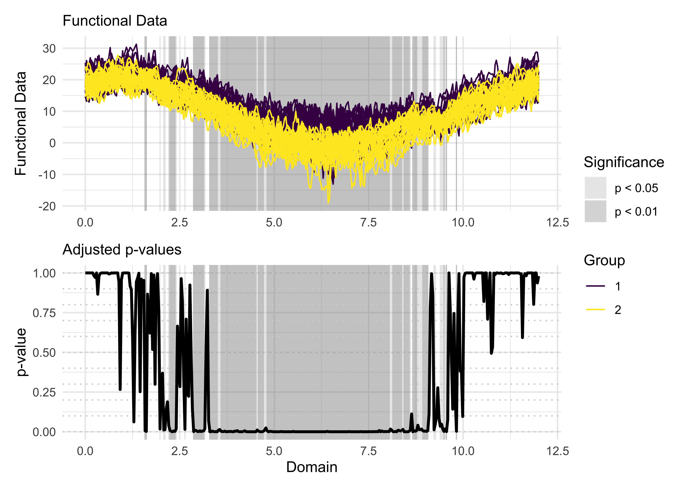

# fdatest

The goal of fdatest is to implement various statistical methods for
domain selection in functional data analysis, that is selecting a subset
of the domain where the difference between two populations is
significant. The package is based on the paper by Abramowicz et
al. (2022) and Pini & Vantini (2017).

## Installation

You can install the package from [CRAN](https://CRAN.R-project.org)
with:

``` r
install.packages("fdatest")
```

Alternatively, You can install the development version of fdatest from
[GitHub](https://github.com/) with:

``` r
# install.packages("pak")
pak::pak("permaverse/fdatest")
```

## Example

The package provides several methods for domain selection, including:

- **FDR2**: False Discovery Rate for two populations.
- **Global2**: Global testing for two populations.
- **IWT2**: Interval-Wise Testing for two populations.
- **PCT2**: Partition Closed Testing for two populations.
- **TWT2**: Threshold Wise Testing for two populations.

You can use these methods to test for significant differences between
two populations of functional data. Here is an example using the `TWT2`
method on the NASA temperatures data set:

``` r
library(fdatest)

# Performing the TWT for two populations on the NASA temperatures data set
withr::with_seed(1234, {
  out <- TWT2(NASAtemp$paris, NASAtemp$milan)
})

# Plotting the results of the TWT
plot(
  out,
  xrange = c(0, 12),
  main = 'TWT results for testing mean differences'
)
```


